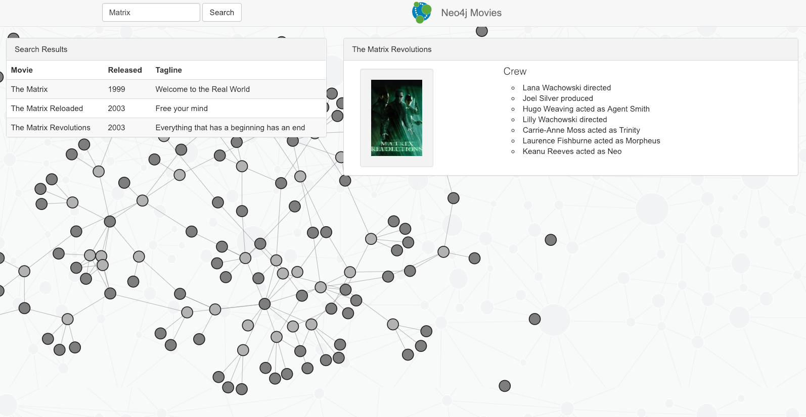

# Example app



This example application demonstrates how easy it is to get started with [neotypes](https://github.com/neotypes/neotypes).

It is a very simple web application that uses the Movie graph dataset to provide a search with listing, a detail view and a graph visualization.

The front-end is just jQuery and d3 and the backend is implemented in Scala using akka-http.

## The Stack

These are the components of our min- Web Application:

* Application Type:         Scala-Web Application
* Web framework:            Akka-http
* Neo4j Database Connector: neotypes
* Database:                 Neo4j-Server
* Frontend:                 jquery, bootstrap, d3.js

## Endpoints:

Get Movie

```
// JSON object for single movie with cast
curl http://localhost:8080/movie/The%20Matrix

// list of JSON objects for movie search results
curl http://localhost:8080/search?q=matrix

// JSON object for whole graph viz (nodes, links - arrays)
curl http://localhost:8080/graph
```

## How to start

1. Run `Boot.scala`
2. Go to [http://localhost:9000/index.html](http://localhost:9000/index.html)
